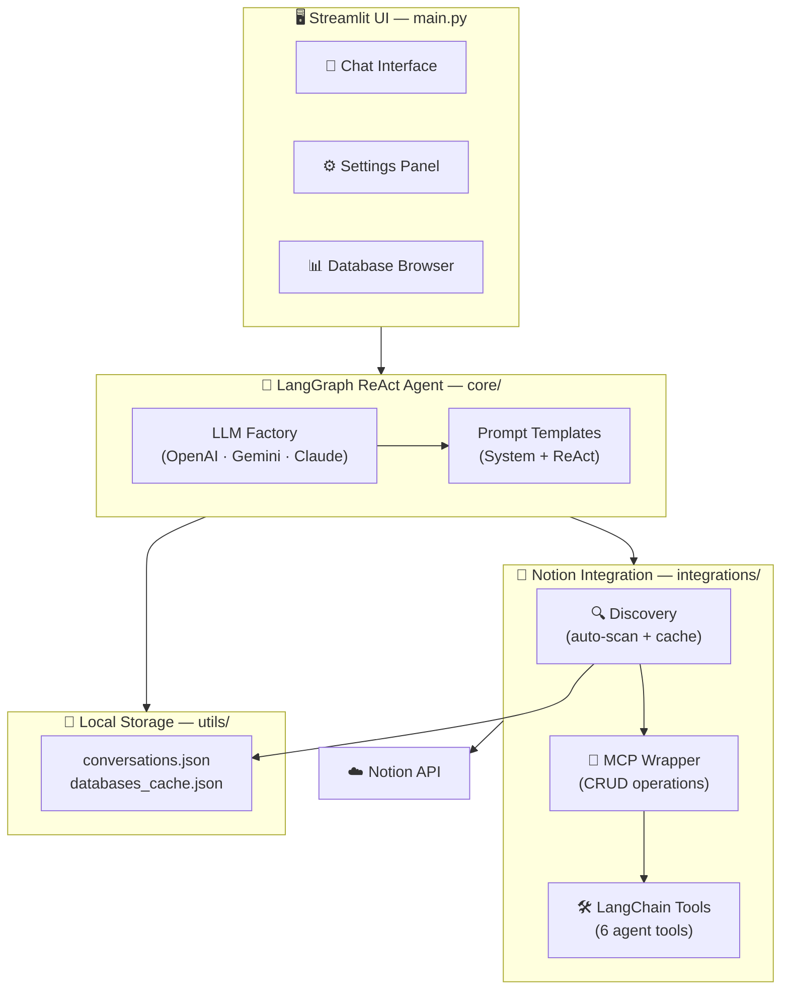

# 🤖 Notion AI Personal Assistant

An intelligent, privacy-first personal assistant that connects to your Notion workspace and lets you interact with your data using natural language. Powered by LangChain, LangGraph, and multiple LLM providers.


---

## ✨ Features

- **🗣️ Natural Language Interface** — Ask questions, give commands, and manage your Notion workspace in plain English
- **📊 Auto Database Discovery** — Automatically finds all databases in your workspace, no hardcoded IDs needed
- **🔄 Full CRUD Operations** — Create, read, update, and delete pages and database entries
- **🧠 Multi-LLM Support** — Switch between OpenAI, Google Gemini, and Anthropic Claude
- **🔒 Privacy-First** — All processing runs locally on your machine
- **💾 Conversation History** — Persistent chat sessions stored locally in JSON
- **🔍 Smart Search** — Full-text search across your entire Notion workspace
- **📋 Schema Inspection** — Agent automatically checks database structure before operations


---

## 🏗️ Architecture



---

## 🚀 Quick Start

### Prerequisites

- Python 3.9+
- A [Notion Integration](https://developers.notion.com/) with API key
- At least one LLM API key (OpenAI, Google Gemini, or Anthropic)

### Installation

```bash
# Clone the repository
git clone https://github.com/YOUR_USERNAME/TOOL_NOTION_AI.git
cd TOOL_NOTION_AI

# Create and activate virtual environment
python -m venv venv

# Windows
venv\Scripts\activate
# macOS / Linux
source venv/bin/activate

# Install dependencies
pip install -r requirements.txt
```

### Configuration

1. **Copy the example environment file:**

```bash
cp .env.example .env
```

2. **Fill in your API keys in `.env`:**

```env
# Required: at least one LLM provider
OPENAI_API_KEY=sk-your-key-here

# Required: Notion
NOTION_API_KEY=ntn_your-key-here
NOTION_PARENT_PAGE_ID=your-page-id-here

# Optional: additional providers
# GOOGLE_API_KEY=your-google-key
# ANTHROPIC_API_KEY=your-anthropic-key
```

3. **Get your Notion Parent Page ID:**

   - Open the page that contains your databases in Notion
   - Copy the page URL: `https://notion.so/My-Page-2d9c824c35f480f0a4e0cec55b65a77c`
   - The **last 32 characters** are your Page ID: `2d9c824c35f480f0a4e0cec55b65a77c`

4. **Share the page with your integration:**

   - Open the page in Notion
   - Click **⋯** (top right) → **Connect to** / **Add connections**
   - Select your integration name → **Confirm**

### Run

```bash
streamlit run main.py
```

Open [http://localhost:8501](http://localhost:8501) in your browser.

---

## 💬 Usage Examples

| You say                                    | Agent does                                                     |
| ------------------------------------------ | -------------------------------------------------------------- |
| *"List all my databases"*                  | Discovers and lists every database in your workspace           |
| *"What tasks do I have?"*                  | Queries your Tasks database and shows entries                  |
| *"Show me the schema of Projects"*         | Displays column names and types for the Projects database      |
| *"Create a new task: Review PR by Friday"* | Inspects schema, then creates an entry with correct properties |
| *"Search for notes about Python"*          | Full-text searches across all shared pages                     |

---

## 📂 Project Structure

```
TOOL_NOTION_AI/
├── main.py                          # Streamlit app entry point
├── config.py                        # Pydantic configuration manager
├── requirements.txt                 # Python dependencies
├── .env                             # API keys (not committed)
│
├── core/
│   ├── llm_factory.py              # Multi-provider LLM factory
│   ├── agent.py                    # LangGraph ReAct agent
│   └── prompt_templates.py         # System & agent prompts
│
├── integrations/
│   ├── notion_discovery.py         # Auto database discovery + caching
│   ├── notion_mcp.py              # Notion API wrapper (CRUD)
│   ├── notion_tools.py            # LangChain tools for agent
│   └── notion_schemas.py          # Property builders & extractors
│
├── utils/
│   └── storage.py                 # JSON-based local storage
│
├── data/                           # Local data (gitignored)
│   ├── conversations.json
│   └── databases_cache.json
│
└── tests/
    └── test_agent.py              # Unit tests
```

---

## 🧩 Supported LLM Providers

| Provider             | Models                                                                   | API Key Env Var     |
| -------------------- | ------------------------------------------------------------------------ | ------------------- |
| **OpenAI**           | `gpt-5-nano`, `gpt-4.1-mini`, `gpt-4o`, `gpt-4o-mini`                    | `OPENAI_API_KEY`    |
| **Google Gemini**    | `gemini-2.0-flash`, `gemini-2.5-flash-preview`, `gemini-2.5-pro-preview` | `GOOGLE_API_KEY`    |
| **Anthropic Claude** | `claude-sonnet-4`, `claude-3-5-haiku`                                    | `ANTHROPIC_API_KEY` |

Switch providers at any time from the sidebar — no restart needed.

---

## 🔧 Development

### Run Tests

```bash
pip install pytest
python -m pytest tests/ -v
```

### Key Dependencies

| Package                                                               | Purpose                         |
| --------------------------------------------------------------------- | ------------------------------- |
| `streamlit`                                                           | Web UI framework                |
| `langchain` + `langgraph`                                             | Agent orchestration             |
| `langchain-openai` / `langchain-google-genai` / `langchain-anthropic` | LLM integrations                |
| `notion-client`                                                       | Official Notion SDK (v2.7+)     |
| `pydantic`                                                            | Configuration & validation      |
| `python-dotenv`                                                       | Environment variable management |

---

## 📝 How It Works

1. **Discovery** — On startup, the app scans your Notion workspace (starting from the parent page) and caches all databases with their schemas.

2. **Agent Loop** — When you send a message, the LangGraph ReAct agent:
   - Analyzes your intent
   - Selects the right tools (`list_databases`, `query_database`, `create_page`, etc.)
   - Executes operations against the Notion API
   - Returns a formatted response

3. **Persistence** — Conversations are saved to `data/conversations.json`. Database metadata is cached to `data/databases_cache.json` to minimize API calls.

---

## 🤝 Contributing

Contributions are welcome! Here's how:

1. Fork the repository
2. Create a feature branch: `git checkout -b feature/my-feature`
3. Commit your changes: `git commit -m "Add my feature"`
4. Push to the branch: `git push origin feature/my-feature`
5. Open a Pull Request

### Ideas for Contributions

- 🎤 Voice input support
- 📊 Data visualization for database analytics
- 🔄 Real-time sync with Notion webhooks
- 🌐 Multi-language UI support
- 🧪 Expanded test coverage
- 📱 Mobile-friendly responsive layout

---

## ⚠️ Important Notes

- **Notion Integration Permissions** — Your integration must be connected to every page/database you want to access. Use **⋯ → Connect to** in Notion.
- **API Rate Limits** — The Notion API has rate limits. The app uses caching to minimize calls, but heavy usage may hit limits.
- **Data Privacy** — Your data is only sent to the LLM provider you choose. No other third parties receive your data.

---

## 📄 License

This project is licensed under the MIT License — see the [LICENSE](LICENSE) file for details.

---

## 🙏 Acknowledgments

- [Notion API](https://developers.notion.com/) — for the powerful workspace API
- [LangChain](https://python.langchain.com/) & [LangGraph](https://langchain-ai.github.io/langgraph/) — for the agent framework
- [Streamlit](https://streamlit.io/) — for the rapid UI development
- [notion-sdk-py](https://github.com/ramnes/notion-sdk-py) — for the Python Notion client
